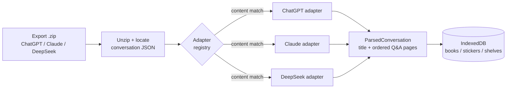

# Structura

**AI gives answers. Structura gives structure.**

Structura turns your AI chat history into a readable library. Each conversation becomes a *book*, each prompt becomes a *chapter*, and the answers become pages you can browse, organize, and annotate — instead of an endless scroll you'll never find anything in again.

It runs entirely in your browser. **No servers, no cloud, no accounts, no telemetry — your data never leaves your device.** And because the source is public, you don't have to take that on faith (see [Verify it yourself](#verify-it-yourself)).

🔗 **Live app:** https://structura.wiki

> _Add a hero screenshot or GIF here — importing a ZIP and flipping through a book is the one that sells it._

---

## What it does

- **Import your real exports.** Drop the ZIP you get from ChatGPT, Claude, or DeepSeek. Structura reads each platform's export format directly — no copy-pasting, no manual cleanup.
- **Read conversations as books.** A color-tabbed spine for navigation, a spacious reading panel for the answers. Rename books and chapters to whatever's clearer than the original prompt — long technical threads finally become something you can actually re-read.
- **Annotate with stickers.** Highlight any passage, turn it into a sticker, and collect every sticker from a book in one place — a summary you built yourself.
- **Organize with shelves.** Group books onto shelves (a book can live on several at once). Filter your library by shelf.
- **Export clean context.** Turn a whole book, a book's highlights, or highlights across many books into a Markdown file — a distilled, self-contained context file you can feed back into any AI chat.
- **Keep everything, lose nothing.** Books, stickers, and shelves persist locally across sessions. Re-importing an updated export won't create duplicates — conversations are identified by content, so the same conversation lands on the same book.

## Quick start

Using the app needs nothing but a browser — open [structura.wiki](https://structura.wiki) and import your export.

To run it locally:

```bash
git clone https://github.com/Vladee101/structura.git
cd structura
pnpm install
pnpm dev
```

Then open the local URL Vite prints. To build for production: `pnpm build`. To run the tests: `pnpm test`.

> **Desktop only.** Your library lives in your browser on the device where you imported it — it's never uploaded anywhere. That keeps it private, but it also means Structura is built for desktop; there's nothing to show on a phone you didn't import on.

## How to get your export

Each platform hands you a ZIP via a download link — that's the file you drop into Structura.

- **ChatGPT** — Settings → Data Controls → Export data. You'll get an email with a download link.
- **Claude** — Settings → Privacy → Export data. You'll get an email with a download link.
- **DeepSeek** — Settings → export your data. You'll get a download link.

Structura only reads the conversation data in the archive. Your uploaded files and images stay on your disk, untouched and unsent.

---

## Privacy

Structura is built so that being private isn't a policy — it's a property of how it works.

- **No backend.** The app is static files. There is no server to send anything to.
- **No accounts, no tracking, no analytics.** The app loads its own code and then talks to no one.
- **Local-only storage.** Conversations, stickers, and shelves live in your browser's IndexedDB, on your machine. (The trade-off: a library is tied to the device it was imported on — there's no cross-device sync, by design.)

### Verify it yourself

Don't trust the claim — check it:

1. Open [structura.wiki](https://structura.wiki) with your browser's DevTools → **Network** tab open.
2. Note that loading the app fetches only its own files (HTML, JS, CSS, favicon) from its own domain. Nothing else.
3. Click **clear** on the Network tab, then **import a conversation, open a book, and create a sticker.**
4. Watch the Network tab: **nothing happens.** No request leaves your machine, because all of it — parsing, storage, rendering — runs in the browser.

If you ever see Structura make a request it shouldn't, that's a bug and a serious one — please [open an issue](https://github.com/Vladee101/structura/issues).

---

## How it works

The interesting part of Structura is the import layer, because three platforms export three completely different formats, and the app normalizes all of them into one internal shape.



Every importer implements one interface — `ConversationAdapter`, with a `detect()` and a `parse()` — and the registry picks the right one by inspecting the file's *content*, not its name (all three platforms name their file `conversations.json`). Each platform's quirks are handled inside its own adapter:

- **ChatGPT** exports a sharded archive with a manifest; conversations are a message *tree* that has to be linearized.
- **Claude** flattens attachments and tool-use blocks into placeholder text that gets stripped.
- **DeepSeek** is a tree without a `current_node` pointer, and interleaves reasoning/search fragments that get filtered out.

The upshot: **adding a new platform is one new file** implementing the interface, plus a fixture and a test. See [Contributing](#contributing).

### Stack

React + Vite + TypeScript + Tailwind on the front end; IndexedDB via [Dexie](https://dexie.org/) for storage; [fflate](https://github.com/101arrowz/fflate) for in-browser unzipping. No backend, by design.

---

## Roadmap

- **Local-LLM enrichment (Ollama).** Optional, opt-in: shorten chapter titles and generate summaries using a model on your own machine — text goes to `localhost`, never to a remote server.
- **More adapters.** Gemini (Google Takeout) and others — a natural [good first issue](#contributing).
- **Shelf "spines" view.** Render a shelf as books standing on it, spines out.
- **EPUB / PDF export.** Turn a book into an actual e-book file.
- **Browser extension for live capture** — pending real demand; the export-file flow is the priority.

---

## Contributing

Contributions are welcome — and the architecture is built to make one kind especially easy: **adding support for a new platform.**

If a tool you use exports its conversations and Structura doesn't read it yet:

1. Look at the existing adapters in `src/adapters/` — they're working examples.
2. Implement the `ConversationAdapter` interface (`detect()` + `parse()`) for the new format in a single new file.
3. Add a small fixture and a test following the existing pattern.
4. Open a pull request.

For anything larger, please open an issue first so we can talk through the approach. Bug reports and reproductions are genuinely valuable too.

By contributing, you agree that your contributions are licensed under the project's license (below).

---

## License

Structura is **source-available**, not open source. It's licensed under the **Functional Source License (FSL-1.1-Apache-2.0)**.

In plain terms:

- You can read, audit, run, self-host, fork, and modify the code, and contribute to it.
- You can use it freely for any purpose that isn't a competing commercial product.
- You can't repackage it as a competing commercial offering.
- Each release automatically becomes open source (Apache 2.0) two years after it ships.

The point of making the source public is trust: a privacy tool should be something you can inspect, not something you have to believe. See [`LICENSE`](./LICENSE) for the full text and https://fsl.software for background.

---

Built by [Vladee101](https://github.com/Vladee101).
